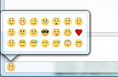
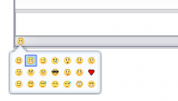

## Smile!

This extension adds a emoticon to the statusbar of conversation windows. It
allows to open a panel and pick an icon from the current smiley theme to insert
into the message that you're currently composing.

